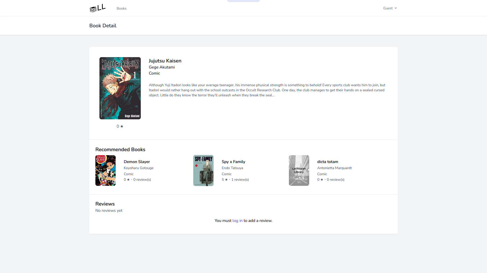
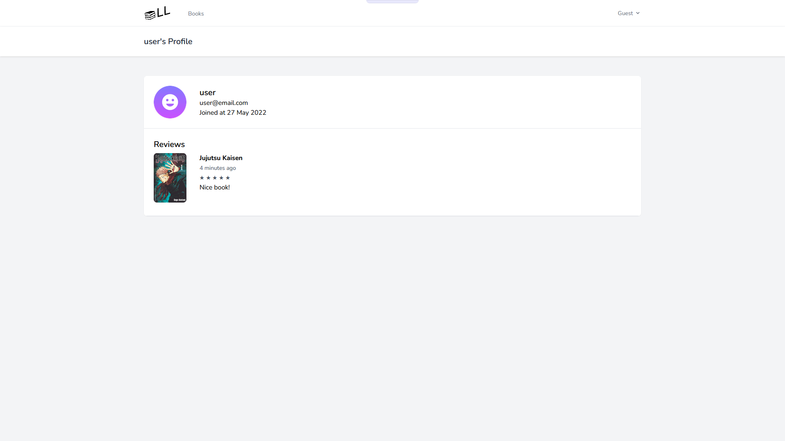
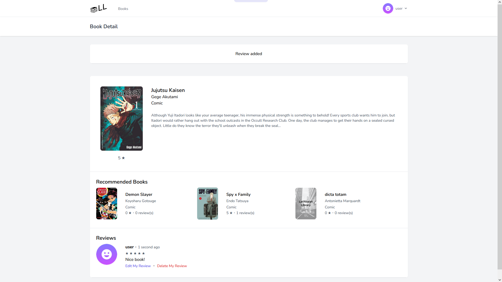

# UAS IF330 - Web Programming

## 📝 Lachisean Library
Masuk ke folder project
```
cd .\lachisean-library\
```

Buat database SQL dengan nama `lachisean_library`, copy template `.env.example` ke file bernama `.env` lalu ganti bagian db. Sesuaikan dengan konfigurasi database SQL yang sudah ada. 
```
DB_CONNECTION=mysql
DB_HOST=127.0.0.1
DB_PORT=3306
DB_DATABASE=lachisean_library
DB_USERNAME=root
DB_PASSWORD=
```

Pastikan package vendor dan node modules terinstall dan database terhubung.
```
composer install
npm install
npm run dev
```
```
php artisan key:generate
php artisan migrate:refresh
php artisan db:seed
```

Ketik command berikut agar storage file terhubung dan tidak terjadi error pada resource gambar.
```
rm public/storage
php artisan storage:link
```

Jalankan website dengan menggunakan command `php artisan serve`.
```
php artisan serve
```
Ketik `localhost:8000` pada browser untuk melihat tampilan website.

Terdapat 2 user yang dapat diakses secara default ketika sudah melakukan seeding data:
```
user@email.com
12345678

admin@email.com
12345678
```

## 👥 Kelompok Lachisean

```
1. 40107 - Laras Wulandari Agfaningrum
2. 43324 - Christopher Matthew Marvelio
3. 28367 - Stefano Irvinne Iversen
4. 27923 - Arif Novianto
```
## 🌐 Demo
Website: <https://lachiseanlibrary.000webhostapp.com/>

## 🚀 Feature/fungsi tambahan
- Pada halaman home, terdapat indikasi rating dan jumlah review pada setiap buku.
- Tombol filter kategori pada halaman home bersifat dinamis. Bila admin menambahkan kategori baru, maka tombol baru akan muncul.
- Bila hasil search/buku dengan kategori yang telah difilter tidak ada, maka akan ada tulisan 'No books found'.
- Pada halaman detail buku, terdapat bagian buku rekomendasi, dimana rekomendasi diambil berdasarkan judul, author, atau kategori yang sama.
- Review yang dapat diberikan user (pengguna yang telah login) berupa tulisan dan rating (1-5).
- Terdapat indikator waktu review dan tanda '(edited)' bila review sudah pernah diedit.
- Pada halaman detail buku, admin dapat mengedit buku dan menghapus review member secara langsung.
- Pada halaman profile diri sendiri, user dapat mengedit/update datanya dan langsung mengedit/delete review yang pernah ia berikan.
- Terdapat info/kolom tambahan pada tabel view admin pada bagian books, category, members, dan reviews. 

## 🎬 Video Presentasi
Vide Presentasi: <https://drive.google.com/drive/folders/18HB29wbadZckalpX4FITUaepVTAMABqt?usp=sharing>

## 📸 Screenshots








